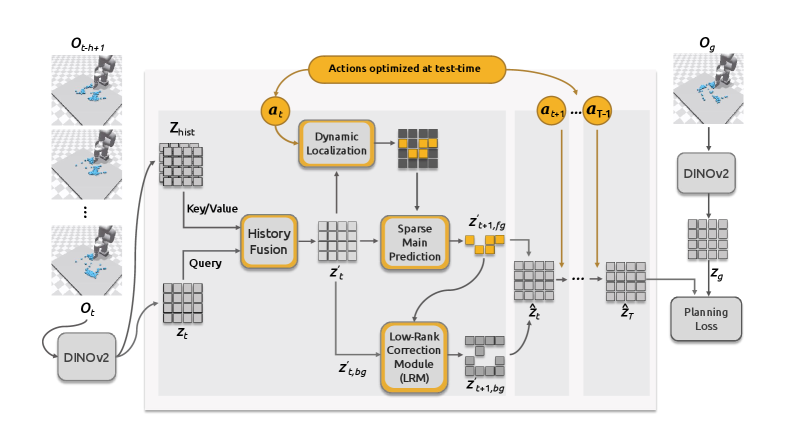

# **DDP-WM**: Disentangled Dynamics Prediction for Efficient World Models
[[Paper]](https://arxiv.org/abs/2602.01780) [[Code]](https://github.com/HCPLab-SYSU/DDP-WM) [[Data]](https://osf.io/bmw48/?view_only=a56a296ce3b24cceaf408383a175ce28)

Shicheng Yin, Kaixuan Yin, Weixing Chen, Yang Liu, Guanbin Li and Liang Lin, Sun Yat-sen University



This repository is the official implementation of **DDP-WM (Disentangled Dynamics Prediction World Model)**, a novel framework designed to tackle the efficiency-performance bottleneck in existing world models. We observe that in most physical interaction scenarios, scene evolution can be decomposed into **sparse primary dynamics** driven by physical interactions and **context-driven background updates**.

Unlike dense models such as DINO-WM, DDP-WM employs a four-stage decoupled process for efficient modeling: it identifies foreground changing regions via **dynamic localization**, focuses computational resources on them using a **primary predictor** for high-precision forecasting, and leverages an innovative **Low-Rank Correction Module (LRM)** to update the background at a minimal cost. This design significantly improves computational efficiency while also providing a smoother optimization landscape for the planner, leading to superior planning success rates across various tasks.

## Acknowledgement

Our codebase is refactored and developed upon the excellent [DINO-WM](https://github.com/gaoyuezhou/dino-wm) project. We sincerely thank the authors of DINO-WM for their great work and for open-sourcing their code.

## Project Status

- [x] Core Model Architecture (`DDP_Predictor`, `DDPVWorldModel`)
- [x] Staged Training Script (`train.py`)
- [x] Hydra Configuration Files (`conf/`)
- [ ] Planning and Evaluation Scripts (`plan.py`, `planning/`)
- [ ] Pre-trained Model Checkpoints

## Getting Started

1.  [Installation](#installation)
2.  [Datasets](#datasets)
3.  [Train a DDP-WM Model](#train-a-ddp-wm-model)

## Installation

Our codebase is an extension of the DINO-WM project. For environment setup, including Conda, Mujoco, and the optional PyFlex installation, please follow the comprehensive **[installation guide](https://github.com/gaoyuezhou/dino_wm#installation)** in the official DINO-WM repository.

After setting up the environment, clone this project:
```bash
git clone https://github.com/HCPLab-SYSU/DDP-WM.git
cd DDP-WM
conda activate dino_wm  # Activate the environment you created following the DINO-WM guide
```

## Datasets

The datasets used in this project are the same as those for DINO-WM and can be downloaded from **[here](https://osf.io/bmw48/?view_only=a56a296ce3b24cceaf408383a175ce28)**.

After downloading and unzipping, set an environment variable pointing to your dataset root directory:
```bash
# Replace /path/to/data with the actual path to your dataset folder
export DATASET_DIR=/path/to/data
```
The expected directory structure is as follows:
```
data
├── deformable
│   ├── granular
│   └── rope
├── point_maze
├── pusht_noise
└── wall_single
```

## Train a DDP-WM Model

The training of DDP-WM is conducted in a staged, decoupled manner to ensure stability and reproducibility. You need to train the different components of the model sequentially.

### Stage 1: Train the Dynamic Localization Network

This stage trains the **Historical Information Fusion Module** and the **Dynamic Localization Network**.
```bash
python train.py model.training_stage=localization env=pusht frameskip=5 num_hist=3
```
Checkpoints are saved under the `outputs/` directory, which can be configured via `ckpt_base_path` in `conf/train.yaml`.

### Stage 2: Train the Sparse Primary Dynamics Predictor

This stage trains the **Primary Dynamics Predictor**. We freeze the weights from the previous stage and use the generated sparse masks to guide the predictor. You need to specify the checkpoint from Stage 1 via `ckpt_path`.

```bash
python train.py model.training_stage=primary_predictor env=pusht frameskip=5 num_hist=3 ckpt_path=<path_to_stage1_checkpoint.pth>
```

### Stage 3: Train the Low-Rank Correction Module (LRM)

Finally, we train the **LRM** to update the background. In this stage, all modules from the previous two stages are frozen.

```bash
python train.py model.training_stage=lrm env=pusht frameskip=5 num_hist=3 ckpt_path=<path_to_stage2_checkpoint.pth>
```

After these three stages, you will have a fully trained DDP-WM model.

## Plan with a DDP-WM Model (Work in Progress)

We are currently refactoring the planning and evaluation scripts to be fully compatible with the new model architecture. This feature will be available in a future update.

## Citation

If you find our work useful, please consider citing our paper:
```bibtex
@misc{yin2026ddpwmdisentangleddynamicsprediction,
      title={DDP-WM: Disentangled Dynamics Prediction for Efficient World Models}, 
      author={Shicheng Yin and Kaixuan Yin and Weixing Chen and Yang Liu and Guanbin Li and Liang Lin},
      year={2026},
      eprint={2602.01780},
      archivePrefix={arXiv},
      primaryClass={cs.CV},
      url={https://arxiv.org/abs/2602.01780}, 
}
```